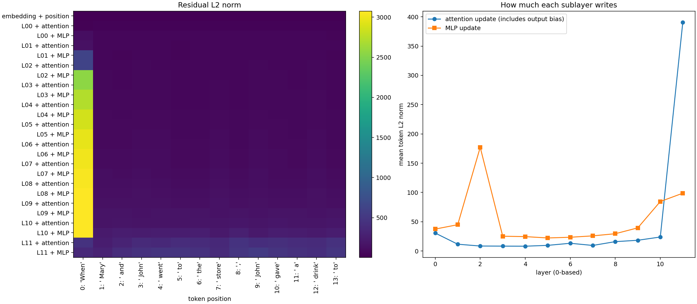

# Mechanistic Interpretability Study

Transformer Circuits thread를 따라 아티클별 실험을 쌓는 비공개 스터디 저장소.

## Week 1

[실행된 Jupyter 노트북](notebooks/01_residual_stream_qk_ov.ipynb):
GPT-2 small의 768차원 residual stream, QK/OV, 그리고
*A Mathematical Framework for Transformer Circuits*의 **One-Layer Attention-Only Transformers**까지.

- 실제 GPT-2: 초기 임베딩과 12개 블록의 attention/MLP 이후 상태, 총 25단계.
- 깊이 애니메이션, 고정 PCA 좌표의 3D 토큰 궤적, 생성 step 애니메이션.
- 레이어/헤드 선택, QK 점수, attention, OV 쓰기와 source별 기여.
- LayerNorm과 bias를 포함한 수치 재구성 검증, prefix 불변성 검사.
- one-layer attention-only 수식을 검증하는 별도의 작은 수작업 모델.

실험 기본 입력은 `When Mary and John went to the store, John gave a drink to`이며
`PROMPT`, `NEW_TOKENS`, `LAYER`, `HEAD`를 수정할 수 있다. 한국어 설명과 토론 질문을 포함한다.



## 실행

검증 대상은 NG-GPU01의 RTX 5090 / WSL Ubuntu 22.04 / Python 3.10이다.
CUDA 12.8 PyTorch 휠을 사용하며 GPU 드라이버나 전역 Python을 변경하지 않는다.

```bash
python3 -m venv .venv
source .venv/bin/activate
pip install torch==2.9.1 --index-url https://download.pytorch.org/whl/cu128
pip install -r requirements.txt
python scripts/build_notebook.py
python scripts/execute_notebook.py
```

`build_notebook.py`는 소스로부터 노트북을 재생성하며 기존 출력을 지운다.
이미 제공된 노트북을 열 때는 재생성이 필요 없다.

```bash
source .venv/bin/activate
python -m ipykernel install --user --name mi-study --display-name 'Python (MI study / RTX 5090)'
python -m jupyter lab --no-browser --ip=127.0.0.1 --port=8888
```

Jupyter는 GPU 호스트의 loopback에만 바인딩한다. 원격 IDE 또는 기존 SSH 포트 전달로 접속하고
`Python (MI study / RTX 5090)` 커널을 선택한다. 최초 모델 로드는 인터넷과 약 0.55GB 다운로드가
필요하다. 모델은 revision `607a30d783dfa663caf39e06633721c8d4cfcd7e`로 고정한다.

## 결과와 읽는 방법

- `notebooks/01_residual_stream_qk_ov.ipynb`: 한국어 해설, 실행 코드, 출력.
- `artifacts/week01-interactive.html`: Plotly 포함 오프라인 재생 보고서. 브라우저로 연다.
- `artifacts/validation.json`: GPU, 버전, 생성 문장, 수치 검증 오차.
- `artifacts/job.json`: 실행 시각, 원격 실행 위치, 완료 상태.
- `artifacts/edge-case-validation.json`: 한 토큰/반복 토큰/추가 문장의 검증.
- `artifacts/browser-validation.json`: 브라우저의 재생, 일시정지, 깊이 슬라이더 검증.
- `artifacts/*-summary.png`: GitHub에서도 보이는 정적 그림.
- `artifacts/prompt-activations.npz`: 로컬 재실행 시 생성. 용량 때문에 Git에는 포함하지 않는다.
- `study.py`: activation 수집 및 그림 함수. `scripts/build_notebook.py`: 노트북 셀 원본.

GitHub는 JavaScript/위젯을 실행하지 않는다. PNG와 수치 결과는 GitHub에서 읽고,
애니메이션은 HTML 또는 신뢰한 Jupyter에서 실행한다. 위젯은 실행 중인 Python 커널이 필요하다.
노트북의 HTML 출력은 CDN을 사용하지만 별도 HTML 보고서는 오프라인이다.
전체 768×768 고정 QK/OV 가중치 그림은 노트북에 포함된다.
residual 애니메이션의 색은 큰 이상값을 함께 보여주기 위해 signed-log를 사용한다.
hover에는 변환 전 값을 표시하며, `scale="raw"`로 선형 색상을 선택할 수 있다.

## 해석 범위

깊이, 토큰 위치, 생성 시간은 별개의 축이다. causal GPT-2에서는 prefix에 새 토큰을 붙여도
기존 위치의 residual은 수치 오차 범위에서 동일하다. 가중치는 생성 도중 변하지 않는다.
PCA와 norm은 요약이고, logit lens는 진단용 readout이다. attention 패턴만으로 인과성을
주장하지 않는다. GPT-2는 MLP와 LayerNorm이 있는 12층 모델이며, 작은 one-layer 예제는
설명용으로 만든 가중치를 사용한다. 논문 학습 실험을 재현했다고 주장하지 않는다.

## 자료

- [Transformer Circuits](https://transformer-circuits.pub/)
- [A Mathematical Framework for Transformer Circuits](https://transformer-circuits.pub/2021/framework/index.html)
- [GPT-2](https://huggingface.co/openai-community/gpt2)

향후 아티클별 노트북을 `notebooks/02_...`, `03_...`으로 추가한다.
